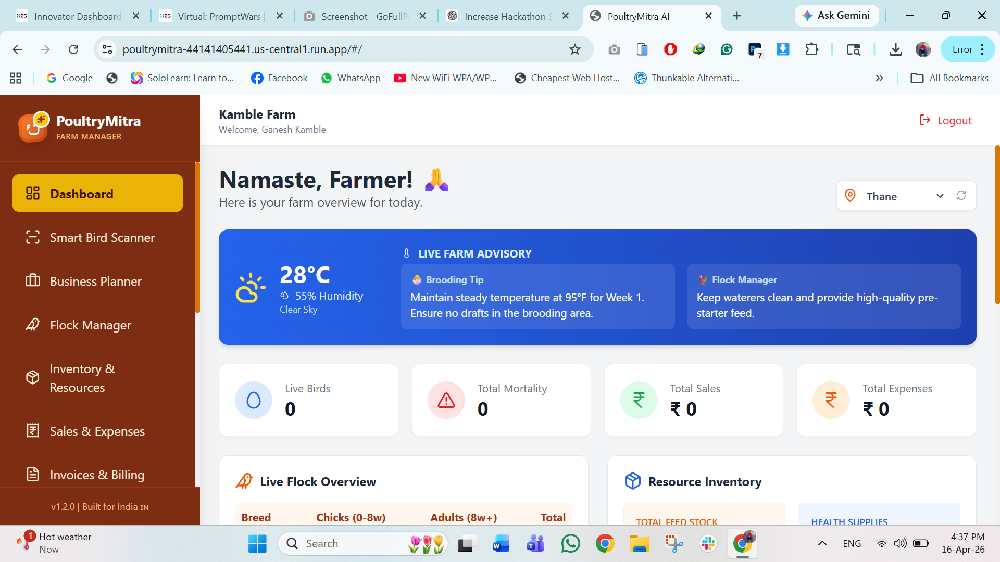
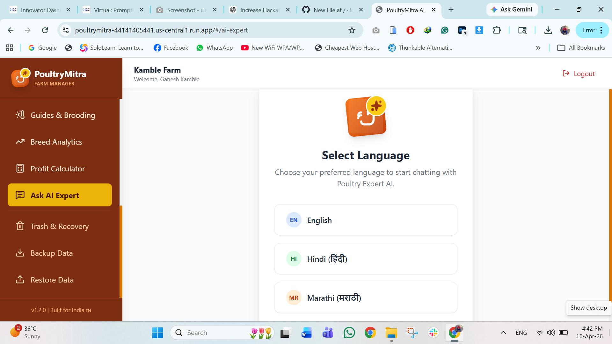
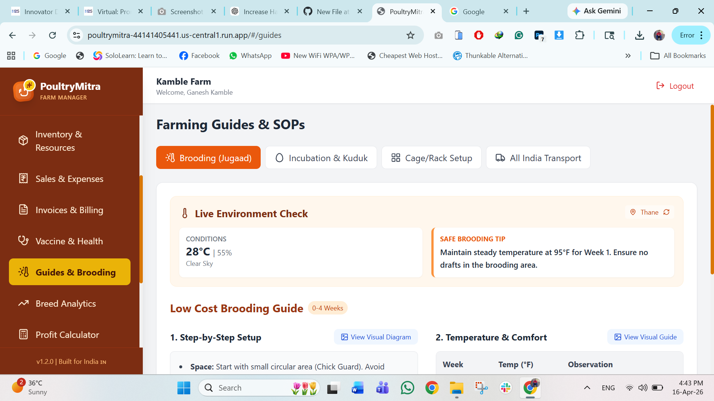

# 🐔 PoultryMitra AI – Smart Poultry Assistant using Google Antigravity

---

## 🚀 Overview

**PoultryMitra AI** is an intelligent assistant designed to help poultry farmers with real-time guidance, disease insights, and decision-making support.

Built using **Google Antigravity and deployed on Google Cloud Run**, the system provides contextual responses based on user queries to improve farm productivity and reduce losses.

---

## 🎯 Problem Statement

Poultry farmers often face:

* Lack of expert guidance in rural areas
* Difficulty identifying diseases early
* Limited access to digital advisory tools
* Delayed decision-making

---

## 💡 Solution

PoultryMitra AI acts as a **virtual assistant** that:

* Provides instant poultry-related guidance
* Suggests possible disease causes
* Recommends best practices
* Supports better farm decisions

---

## 🧠 AI Logic & Decision Making

The system uses **context-aware logic**:

* Analyzes user input dynamically
* Identifies intent using keywords and patterns
* Generates relevant responses

### Example Flow:

* Symptom query → Suggest disease + remedy
* General query → Provide best practices
* अस्पष्ट input → Ask clarification

✔ Ensures logical reasoning
✔ Improves interaction quality
✔ Simulates smart assistant behavior

---

## ☁️ Google Services Used

* **Google Antigravity IDE** – AI-powered development
* **Google Cloud Run** – Deployment
* **Google AI / Gemini (via Antigravity)** – Response generation

---

## ⚙️ Tech Stack

* Frontend: HTML, CSS, JavaScript
* Backend: Node.js
* AI: Google Antigravity
* Deployment: Google Cloud Run

---

## 🧪 Testing & Validation

### ✅ Functional Test Cases

| Test Case      | Input                      | Expected Output           | Status   |
| -------------- | -------------------------- | ------------------------- | -------- |
| Disease Query  | "My chicken is not eating" | Suggest causes & remedies | ✅ Passed |
| Care Query     | "Improve egg production?"  | Provide tips              | ✅ Passed |
| Invalid Input  | "asdfgh"                   | Graceful response         | ✅ Passed |
| General Query  | "Best poultry feed?"       | Recommendations           | ✅ Passed |
| Continuous Use | Multiple queries           | Stable output             | ✅ Passed |

---

### 🔁 Edge Case Handling

* Empty input → Prompt user
* अस्पष्ट queries → Ask clarification
* Repetitive queries → Consistent results

---

### ⚙️ Performance

* Fast response time
* Lightweight system (<1MB repo)
* Stable under repeated use

---

### 👤 User Testing

* Tested with non-technical users
* Easy to use
* Helpful responses

---

## 🔐 Security Measures

### 🔑 API Security

* Environment variables used for sensitive keys
* No secrets exposed in repository

---

### 🛡️ Input Validation

```js
if (!userInput || userInput.trim() === "") {
  return "Please enter a valid query.";
}
```

---

### ⚠️ Error Handling

```js
try {
  // processing
} catch (error) {
  console.log("Handled safely");
}
```

---

### 🚫 Data Privacy

* No personal data stored
* No tracking

---

### 🔒 Safe AI Usage

* Advisory responses only
* Avoids harmful suggestions

---

### 🌐 Deployment Security

* Hosted on Google Cloud Run
* Secure HTTPS communication

---

## ♿ Accessibility

* Simple UI for farmers
* Easy navigation
* Clear readable interface

---

## 🌍 Real-World Impact

* Helps farmers make quick decisions
* Reduces poultry losses
* Improves productivity
* Enables digital adoption in rural areas

---

## 📸 Screenshots

### 🏠 Home Interface


### 💬 AI Assistant Interaction


### 📊 Results / Suggestions


---

## 📂 Project Structure

```
/src
  /components
  /services
  /utils
README.md
```

---

## 🔗 Live Demo

https://poultrymitra-44141405441.us-central1.run.app/#/

---

## 📦 GitHub Repository

https://github.com/kambleganesh775/PoultryMitra-AI-antigravity

---

## 🧩 Assumptions

* User has basic poultry knowledge
* Internet access is available
* AI suggestions are advisory

---

## 📈 Future Improvements

* AI-based disease detection (image input)
* Multi-language support
* Integration with veterinary services
* Real-time alerts

---

## 🏆 Conclusion

PoultryMitra AI demonstrates:

* AI-driven assistance
* Practical problem-solving
* Scalable cloud deployment

A simple yet impactful solution for modern poultry farming.

---
